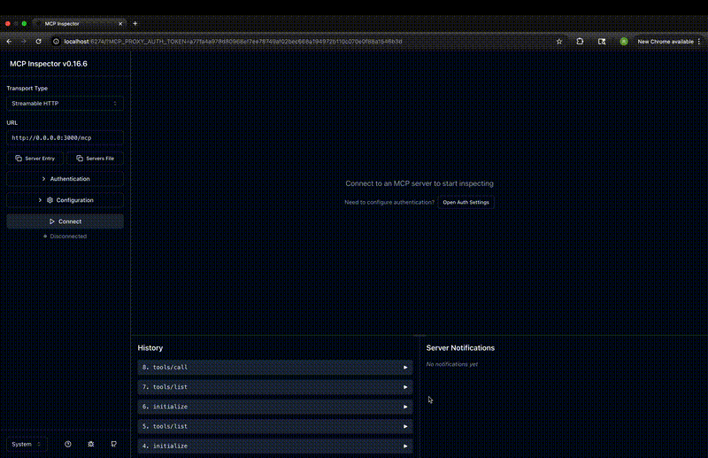

# Development Guide

This guide covers development setup, tool development process, and comprehensive testing strategies for the Data Intelligence MCP Server.

## Table of Contents

1. [Dev Setup](#1-dev-setup)
2. [Tool Development](#2-tool-development)
3. [Testing](#3-testing)
   - 3.1 [Inspect MCP Tool](#31-inspect-mcp-tool)
   - 3.2 [Unit Test](#32-unit-test)
   - 3.3 [Integration Test](#33-integration-test)
   - 3.4 [Tool Eval](#34-tool-eval)

## 1. Dev Setup

### Prerequisites

- **Python 3.11+** - Required for modern Python features
- **uv** - Fast Python package manager and project manager
- **Git** - Version control

### Environment Setup

1. **Clone the repository**:
   ```bash
   git clone https://github.com/IBM/data-intelligence-mcp-server.git
   cd data-intelligence-mcp-server
   ```

2. **Create virtual environment and install dependencies**:
   ```bash
   # Setup virtual environment with uv
   uv venv

   # Install all dependencies including dev tools
   uv pip install -e .[dev]

   # Or sync with lock file
   uv sync
   ```

3. **Environment Configuration**:
   ```bash
   # Copy example environment file
   cp .env.example .env

   # Edit .env with your configuration
   # Set service_url, AUTH tokens, etc.
   ```

### Development Commands

| Command | Description |
|---------|-------------|
| `make run` | Run MCP server in default mode |
| `make run-stdio` | Run MCP server in stdio mode |
| `make lint` | Check code style and errors |
| `make lint-fix` | Auto-fix linting issues |
| `make clean` | Remove build artifacts |

## 2. Tool Development

### Service Management

| Command | Description | Example |
|---------|-------------|---------|
| `make service-list` | List all services and tools | |
| `make service-create name=<name>` | Create new service | `make service-create name=my_service` |
| `make service-add-tool service=<svc> tool=<tool>` | Add tool to service | `make service-add-tool service=dummy tool=new_tool` |

### Creating a New Tool
Below make command can be use to create a service and tool under it
```sh
make service-create name=my_service
make service-add-tool service=my_service tool=my_tool
```
It will create the below directory structure and template code for the tool.

```
app/services/my_service/
├── __init__.py
├── manifest.yaml          # Service metadata
├── models/
│   ├── __init__.py
│   └── my_tool.py         # Pydantic models
└── tools/
    ├── __init__.py
    └── my_tool.py         # Tool implementation
```

#### 2. Define Models
Create Pydantic models in `app/services/my_service/models/my_tool.py`:

```python
from pydantic import BaseModel, Field

class MyToolRequest(BaseModel):
    input_param: str = Field(..., description="Description of input parameter")
    optional_param: int = Field(default=1, description="Optional parameter")

class MyToolResponse(BaseModel):
    result: str = Field(..., description="Tool output result")
    metadata: dict = Field(default_factory=dict, description="Additional metadata")
```

#### 3. Implement Tool
Create tool function in `app/services/my_service/tools/my_tool.py`:

```python
from app.core.registry import service_registry
from app.services.my_service.models.my_tool import MyToolRequest, MyToolResponse

@service_registry.tool(
    name="my_service:my_tool",
    description="Description of what the tool does",
    tags={"category", "my_service"},
    meta={"version": "1.0", "service": "my_service"}
)
async def my_tool(input: MyToolRequest) -> MyToolResponse:
    """Tool implementation."""
    # Process input
    result = f"Processed: {input.input_param}"

    return MyToolResponse(
        result=result,
        metadata={"processed_at": "timestamp"}
    )
```

#### 4. Tool Registration
Tools are automatically registered via the `@service_registry.tool` decorator. The registration happens during service discovery at startup.

### Tool Development Best Practices

- **Naming**: Use `service_name:tool_name` format
- **Documentation**: Include comprehensive descriptions and examples
- **Error Handling**: Handle edge cases and provide meaningful error messages
- **Async**: Use async/await for I/O operations
- **Type Hints**: Use proper type annotations for all parameters
- **Validation**: Leverage Pydantic for input validation

## 3. Testing

### 3.1 Inspect MCP Tool
#### MCP Inspector Tool

Make sure npm is installed on your machine

Run below:
```sh
npx @modelcontextprotocol/inspector
```



### 3.2 Unit Test

Please refer Fastmcp doc for writing good tests:
https://gofastmcp.com/development/tests

Unit tests validate individual components in isolation.

#### Generate Test Stubs
```bash
# Generate test stub for specific tool
make test-generate-tool service=my_service tool=my_tool
```

#### Run Unit Tests
```bash
# Run all unit tests
make test

# Run specific test file
uv run python -m pytest tests/services/dummy/test_lineage.py -v

# Run tests with pattern matching
uv run python -m pytest tests/ -k "RequestModel" -v
```

#### Unit Test Structure
```python
class TestMyToolRequestModel:
    """Test MyToolRequest model validation."""

    def test_valid_request_creation(self):
        """Test creating valid requests."""
        request = MyToolRequest(input_param="test")
        assert request.input_param == "test"

    def test_field_validation(self):
        """Test field constraints."""
        with pytest.raises(ValidationError):
            MyToolRequest()  # Missing required field

class TestMyToolFunction:
    """Test my_tool function."""

    @pytest.mark.asyncio
    async def test_basic_functionality(self):
        """Test core tool logic."""
        request = MyToolRequest(input_param="test")
        response = await my_tool(request)

        assert isinstance(response, MyToolResponse)
        assert "test" in response.result
```

#### Mocking External Dependencies

FastMCP servers are standard Python objects, so you can mock external dependencies using your preferred approach:

```python
from unittest.mock import AsyncMock

async def test_database_tool():
    server = FastMCP("DataServer")

    # Mock the database
    mock_db = AsyncMock()
    mock_db.fetch_users.return_value = [
        {"id": 1, "name": "Alice"},
        {"id": 2, "name": "Bob"}
    ]

    @server.tool
    async def list_users() -> list:
        return await mock_db.fetch_users()

    async with Client(server) as client:
        result = await client.call_tool("list_users", {})
        assert len(result.data) == 2
        assert result.data[0]["name"] == "Alice"
        mock_db.fetch_users.assert_called_once()
```

#### Test Categories
- **Model Validation**: Pydantic model constraints and field validation
- **Business Logic**: Core tool functionality and edge cases
- **Error Handling**: Invalid inputs and error scenarios
- **Service Registry**: Tool registration and metadata

### 3.3 Integration Test

In Progress

### 3.4 Tool Eval
In Progress
