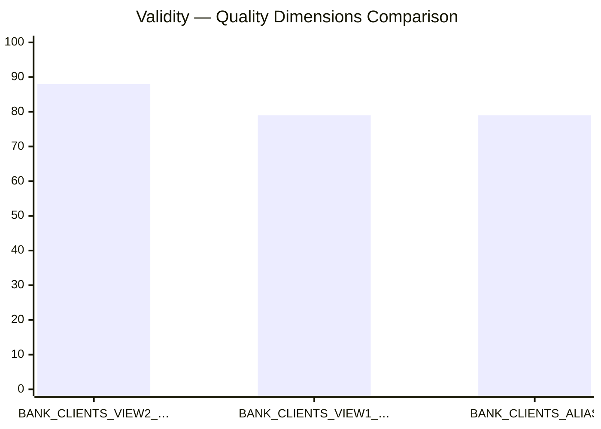
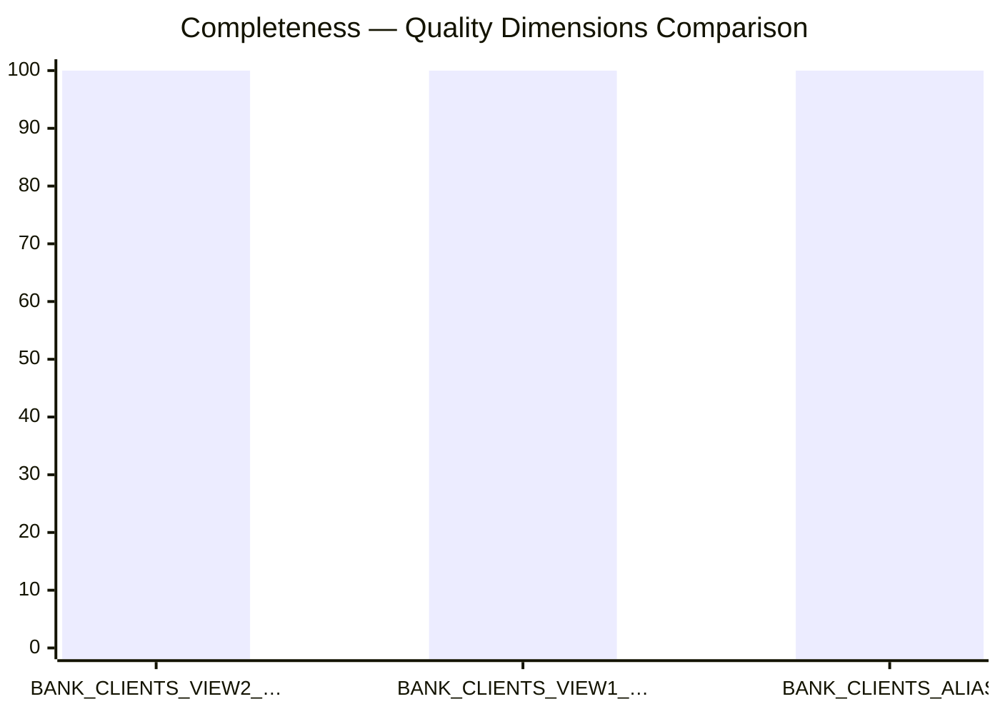

# Overview
Generate Mermaid xychart-beta bar charts visualizing data quality dimensions
(Overall Score, Validity, Completeness, Uniqueness, Consistency) across multiple
assets. Use this skill whenever the user provides quality/dimension data and asks
for a chart, graph, visualization, or bar chart — especially when assets, datasets,
or tables are being compared across multiple quality dimensions. Trigger even if
the user just pastes JSON data with dimension scores and doesn't explicitly say
"chart" or "mermaid". Also trigger for phrases like "visualize my quality scores",
"show me the dimensions", "quality comparison chart", or "chart this data".
---

# Quality Dimensions Chart (Mermaid)

Generates **one Mermaid `xychart-beta` bar chart per dimension**, each showing all
asset scores for that dimension. Simple, no grouped-bar workarounds needed.

---

## Input Format

```json
{
  "title": "Quality Dimensions Comparison",
  "assets": [
    {
      "name": "ASSET_NAME",
      "overall_score": 95,
      "validity": 88,
      "completeness": 100,
      "uniqueness": 100,
      "consistency": 100
    }
  ]
}
```

- All scores: integers or floats 0–100.
- `overall_score` is optional; skip its chart entirely if absent from all assets.
- If the user provides a Markdown table or natural language, extract values first.

---

## Dimensions & Order

Render one chart per dimension in this order (skip any absent from all assets):

1. **Overall Score**
2. **Validity**
3. **Completeness**
4. **Uniqueness**
5. **Consistency**

---

## X-axis Label Rules

Asset names are often long. To avoid overflow:

- Truncate each name to **20 characters max**, appending `…` if cut: `BANK_CLIENTS_VIEW2_…`
- Always wrap labels in **double quotes**: `"BANK_CLIENTS_VIEW2_…"`
- This mimics the rotated labels of a Python chart — Mermaid doesn't support rotation,
  so truncation is the equivalent mitigation.

---

## Chart Template

One chart per dimension:

```
```mermaid
xychart-beta vertical
    title "<DIMENSION> — <TITLE>"
    x-axis ["ASSET_1", "ASSET_2", "ASSET_N"]
    y-axis 0 --> 100
    bar [val_1, val_2, val_n]
` `` 
```

- Title format: `"Validity — Quality Dimensions Comparison"`
- Missing value for an asset: use `0` and note it below the chart.

---

## Full Worked Example

Input:
```json
{
  "title": "Quality Dimensions Comparison",
  "assets": [
    { "name": "BANK_CLIENTS_VIEW2_ALIAS", "validity": 88, "completeness": 100, "uniqueness": 100, "consistency": 100 },
    { "name": "BANK_CLIENTS_VIEW1_ALIAS", "validity": 79, "completeness": 100, "uniqueness": 100, "consistency": 100 },
    { "name": "BANK_CLIENTS_ALIAS",       "validity": 79, "completeness": 100, "uniqueness": 100, "consistency": 100 }
  ]
}
```

Output — one block per dimension:

**Validity**


**Completeness**


*(and so on for Uniqueness, Consistency)*

---

## Output Template

For each dimension, output in this order:
1. A bold heading with the dimension name.
2. The Mermaid code block.
3. Nothing else — no intro text, no explanations, no notes unless a value was missing.

---

## Edge Cases

| Situation | Handling |
|---|---|
| Missing value for one asset | Use `0`; add a one-line note after that chart only |
| `overall_score` absent from all assets | Skip that chart entirely |
| Score > 100 or < 0 | Clamp to [0, 100]; add a one-line warning after that chart |
| Asset name ≤ 20 chars | No truncation needed; quote as-is |